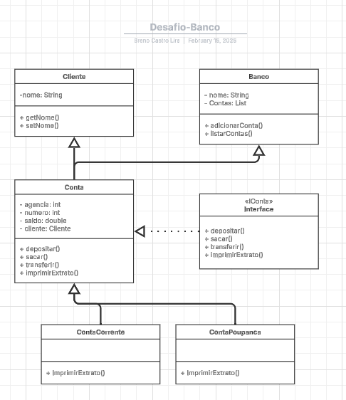

## Início

Objetivo: O objetivo deste projeto prático hands-on é reforçar o conhecimento em Programação Orientada a Objetos (POO) em Java, através da implementação de um banco digital.
#### Gráfico UML do projeto: 

#### Descrição:
Neste projeto, foram utilizados os conceitos de POO e Java aprendidos nos cursos da Formação Java Developer para criar um banco digital e conceitos extras de confecção de gráficos UML. O contexto bancário será explorado para explorar os pilares da orientação a objetos, e assim sendo, a aplicação será capaz de: 
- criar contas corrente e/ou poupança (implementadas com SEQUENCIAL);
- Efetuar saques dessas contas;
- Imprimir extratos com saídas devidamente formatadas;
- Fazer transferências bancárias para outras contas ou poupanças existentes.

#### Features Adicionais:

Para essa parte do desafio, foi criada uma branch "desafio-breno" onde foram implementadas as seguintes melhorias:
- Criar uma lista de Contas na classe Banco;
- Indexar a um cliente cada conta criada;
- Imprimir um extrato com nome do cliente;

Requisitos Técnicos:
- Conhecimentos básicos de Programação Orientada a Objetos em Java;
- Ambiente de desenvolvimento Java configurado;
- Acesso à internet para acesso ao projeto de referência no GitHub;
- Familiaridade com o uso de repositórios Git (opcional, mas recomendado);
- Capacidade de abstração para reproduzir a solução proposta e implementar melhorias.

## Estrutura de pastas

A área de trabalho contém duas pastas por default, onde:

- `src`: pasta para manter as fontes
- `lib`: pasta para manter as depenências

Enquanto isso, o compilador de arquivos de saída será gerado na pasta `bin` por default.

> Se você quiser personalizar a estrutura de pastas, abra `.vscode/settings.json` e atualize as configurações relacionadas lá.

## Gerenciamento de Dependências

A visualização `JAVA PROJECTS` permite que você gerencie suas dependências. Mais detalhes podem ser encontrados [aqui](https://github.com/microsoft/vscode-java-dependency#manage-dependencies).